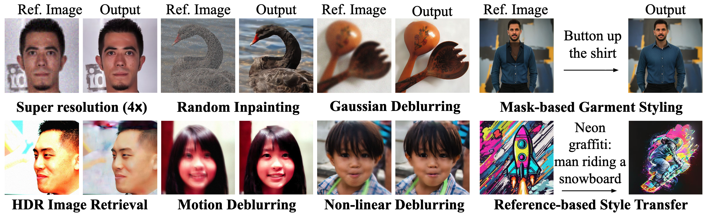

<div align="center">
<h1>Test-Time Anchoring for Discrete Diffusion Posterior Sampling</h1>

<a href='https://anchored-discrete-ps.github.io/'></a>
<a href=''></a>
[](https://github.com/LituRout/APS)
</div>

We introduce <em>Anchored Posterior Sampling (APS)</em> for masked diffusion foundation models, built on two key innovations: (i) quantized expectation, which provides gradient-like guidance for discrete diffusion with purely discrete embedding space, and (ii) anchored remasking, which enables adaptive decoding during inference. Our method supports a variety of linear and nonlinear image restoration tasks (left three columns), as well as mask-based garment styling and reference-guided style transfer (last column).





## 🔥 Updates
- **[2025.10.02]** Paper is published on arXiv!


## Citation

```
@article{rout2025anchored,
  title     = {Test-Time Anchoring for Discrete Diffusion Posterior Sampling},
  author    = {Rout, L. and Lugmayr, A. and Jafarian, Y. and Varadharajn, S. and Caramanis, C. and Shakkottai, S. and Shlizerman, I.}
  booktitle = {arXiv preprint},
  year      = {2025}
}
```

<!-- ## Star History

[](https://star-history.com/#LituRout/APS&Date) -->
